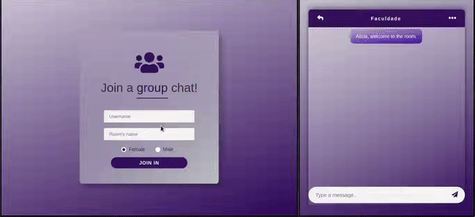
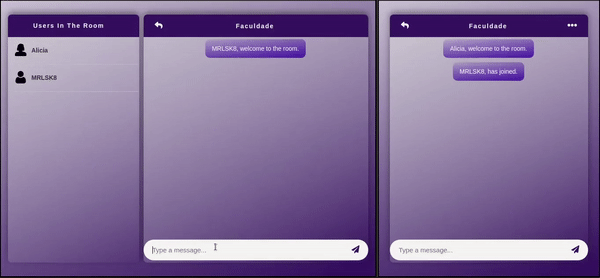
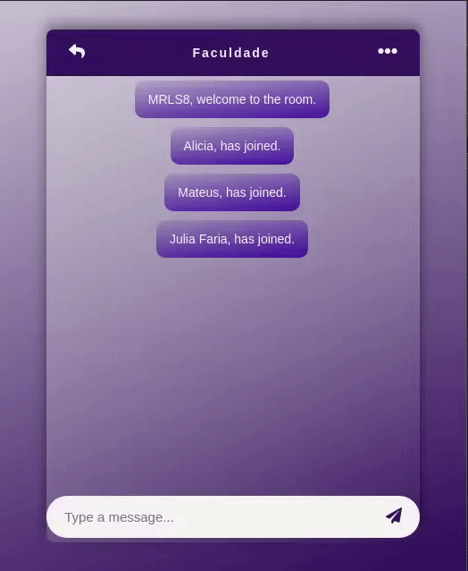

# Group Chatting Application
---
## Demo
https://group-chatting.netlify.com/

## Loging into the page
When logging into the application, all users who are already logged in will be notified that a new user has just entered the room.

## Chatting in the app
Right on the left side, you can see all the users who are in the room with you. 

> PS: This is the standard for **desktop** devices or any other larger device.

   
*On the left side, the application opened on a desktop device and, on the right, the app opened on a mobile phone.*

## What about using the app on a mobile device?
If you are using a cell phone or any other small screen device, just click on the three dots up in the top right corner, and you will see all the users who are in the room.

### Hit me up on one of my social medias :)

[Facebook](https://www.facebook.com/profile.php?id=100004301021977 'My facebook')  |  [Instagram](https://www.instagram.com/mrlsk8/ 'My instagram')  |  [Linkedin](https://www.linkedin.com/in/mrlsk8/ 'My linkedin')

## License :memo::

This project is licensed under the MIT License - see the [LICENSE](LICENSE) file for details.

## Author :man_technologist::

Made with :heart: by **Marcelo Lima** 😊
